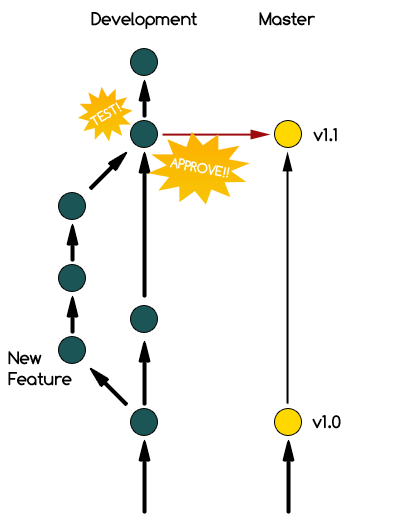

!SLIDE center

!SLIDE center bullets

## (You should know this by now) ##

* Distributed VCS
* Very fast
* No server needed
* You can branch the hell out of everything

!SLIDE center

# + #

!SLIDE bullets

* Using SVN since 2007
* Started using Git about 4 months ago
* Used as the main VCS in 2 client projects

!SLIDE bullets
# Repository Structure #
* Two permanent remote branches, **master** and **development**
* Local (topic) branches off of development
* Master branch is *only* used for production-ready code

!SLIDE center

!SLIDE bullets

* Branching maps to Production and Staging servers
* Development Branch --> Staging Site
* Master Branch --> Production Site

!SLIDE bullets
# Workflow #
## (Agile) ##

* New features developed in local topic branches off of development
* When feature is ready for client testing, merged into development

!SLIDE center

(From http://progit.org/book/ch3-4.html)

!SLIDE bullets
# Branching #
* Local and Remote branches
* Long-lived branches (e.g. master and development)
* Short-lived (topic) branches for each feature
* Branching and merging multiple times a day

!SLIDE bullets incremental
# Installing A Hosted Git Service #

* first point
* second point
* third point
