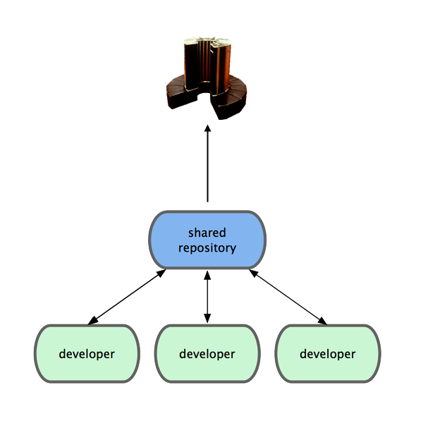
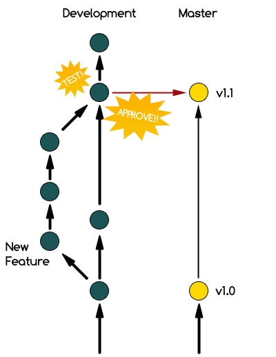

!SLIDE center

!SLIDE center bullets

## (You should know this by now) ##

* Distributed VCS
* Very fast
* No server needed
* You can branch the hell out of everything

!SLIDE center

# + #

!SLIDE bullets

* Using SVN since 2007
* Started using Git about 4 months ago
* Used as the main VCS in 2 client projects

!SLIDE center
## Note: We Use Git as a Centralized Repository ##
### You don't have to do this ###

!SLIDE center

!SLIDE bullets
# Repository Structure #
* Two permanent remote branches, **master** and **development**
* Local (topic) branches off of development
* Master branch is *only* used for production-ready code

!SLIDE center

(From http://progit.org/book/ch3-4.html)

!SLIDE bullets

* Branching maps to Production and Staging servers
* Development Branch ==> Staging Site
* Master Branch ==> Production Site

!SLIDE center
# Workflow #
## (Agile) ##

!SLIDE bullets
* New features developed in local topic branches off of development

!SLIDE commandline incremental
    $ git branch sweetness-feature
    $ git checkout sweetness-feature
    Switched to a new branch 'sweetness-feature'
    *hackity hack hack hack...*

!SLIDE bullets
* When feature is ready for client testing, merged into development

!SLIDE commandline incremental

    $ git rebase development
    Current branch sweetness-feature is up to date.
    
    $ git checkout development
    Switched to branch 'development'
    
    $ git merge sweetness-feature
    
    $ rake test
    ................................................................................
    Finished in 29.773033 seconds.
    
    $ git push origin development

    $ cap staging deploy
    Pushing to staging server from development...

!SLIDE bullets

  * Client reviews material and accepts the feature (ideally)
  * Now ready to merge into master and move onto production
  
!SLIDE commandline incremental

    $ git checkout master
    Switched to branch 'development'

    $ git merge development
    * Merged!! *

    $ rake test
    ................................................................................
    Finished in 29.773033 seconds.

    $ git tag -a v1.1

    $ git push origin master

    $ cap production deploy

!SLIDE center

!SLIDE bullets
# Benefits We've Seen #
* Fewer merge conflicts, since each feature is safe in its sandbox
* Flexible workflow
* Hotfixes on Master branch that can be merged back into development
* Increased number of smaller commits

!SLIDE bullets

* "My company uses X VCS, and they won't switch, what should I do?

!SLIDE bullets
# Sneaky Git #

* Git works well with other systems
* We use git-svn all the time
* Retains use of fast commiting, topic branches, etc.
* No remote branches

!SLIDE commandline incremental

    $ git svn clone -t http://svn.singlebrook.com/svn/old_project
    
    $ git svn clone -t -r1730:HEAD http://svn.singlebrook.com/svn/old_project
    ....clones the only commits since rev. 1730....
    
!SLIDE center
# Work like usual #

!SLIDE commandline incremental

    $ git svn rebase
    ....update repository with latest SVN revisions....
    
    $ git commit -a -m "Commits, etc"
    
    $ git svn dcommit
